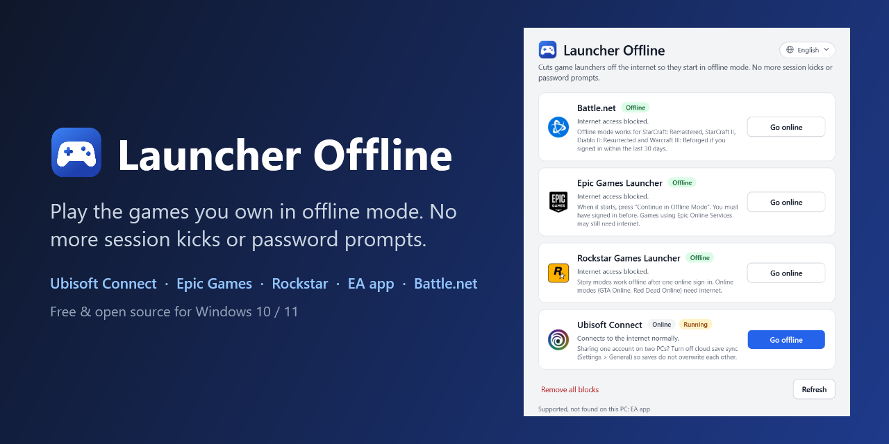

# Launcher Offline



**Play the PC games you own in offline mode, without launchers logging you out or asking for your password.**

Launcher Offline is a free, open-source Windows app that puts game launchers (**Ubisoft Connect, Epic Games Launcher, Rockstar Games Launcher, EA app and Battle.net**) into their own official offline mode with one click. It blocks only the launcher's internet access through Windows Firewall. Your games, saves and accounts are not touched.

[](https://github.com/cngil/launcher-offline/actions/workflows/ci.yml)
[](LICENSE)


## Why

- **Two PCs, one account.** Signing in on one PC kicks the other one out ("your account is being used on another device"). With the launcher offline on one or both PCs, both can play single player at the same time.
- **Endless sign-in prompts.** The launcher forgets your session, asks for your password and 2FA code again, or its servers are down, and you only want to play a single-player game you bought.
- **No internet or a bad connection.** Travel, metered connection, LAN party.

## Install

**One line (recommended).** Open PowerShell and paste:

```powershell
irm https://raw.githubusercontent.com/cngil/launcher-offline/main/install.ps1 | iex
```

This copies the app to `%LOCALAPPDATA%\LauncherOffline`, adds a **Launcher Offline** shortcut to the Start menu and the desktop, and opens it. Run the same line again to update.

**No install.** [Download the ZIP](https://github.com/cngil/launcher-offline/archive/refs/heads/main.zip), extract it anywhere and double-click `LauncherOffline.cmd`.

Requirements: Windows 10 or 11 with Windows Firewall turned on. Nothing to build: it is a PowerShell script with a WPF window, and Windows PowerShell 5.1 is built into Windows.

## Use

1. Sign in to your launcher once while online and start your game once. Offline mode needs a remembered sign-in, and some games need a first activation.
2. Open **Launcher Offline** and press **Go offline** next to the launcher. Windows asks for administrator permission once.
3. Open the launcher and play.

If a launcher wants to go online now and then (updates, license refresh), press **Go online**, let it update, then **Go offline** again.

| State | Meaning |
|---|---|
| **Online** | Not blocked. The launcher works normally. |
| **Offline** | Blocked. The launcher starts in offline mode. |
| **Needs repair** | The launcher was updated or moved, so the block points to old files. Press **Repair**. |

## Supported launchers

| Launcher | Blocked programs | Status |
|---|---|---|
| Ubisoft Connect | `upc.exe`, `UplayWebCore.exe` | Tested (with Far Cry 6) |
| Epic Games Launcher | `EpicGamesLauncher.exe`, `EpicWebHelper.exe` | Tested (press "Continue in Offline Mode") |
| Rockstar Games Launcher | `Launcher.exe`, `LauncherPatcher.exe`, `RockstarService.exe`, `SocialClubHelper.exe` | Not tested yet |
| EA app | `EADesktop.exe`, `EABackgroundService.exe` | Not tested yet |
| Battle.net | `Battle.net.exe`, `Battle.net Launcher.exe` | Not tested yet |

**Tested** means the launcher was checked on a real PC: once blocked, it starts in its offline mode and none of its programs make an outbound connection. The others should behave the same way but have not been confirmed yet. In our test Rockstar showed its offline mode with no connections, but playing offline was not checked with a signed-in account, and Battle.net stopped at a required-update screen. Please [open an issue](https://github.com/cngil/launcher-offline/issues) to report how a launcher behaves, or to request a new one.

Games themselves are never blocked. Online-only games and online modes (GTA Online, multiplayer) still need the launcher to be online.

## How it works

- For each launcher, one **outbound block rule** per program is added to Windows Firewall. Rules are grouped as `LauncherOffline`, so you can inspect them in *Windows Defender Firewall with Advanced Security*.
- Rules point at the real file. Launchers installed through Scoop or other tools that use junctions (`...\current\...`) work too, and **Repair** re-points the rules after an update.
- Nothing else is changed: no launcher settings, no hosts file edits, no game file changes, no DRM tampering, no background service, no registry settings.
- The window runs as your normal user. Only the firewall change runs elevated, in a short-lived helper process.

## Command line

```powershell
$lo = "$env:LOCALAPPDATA\LauncherOffline\src\LauncherOffline.ps1"   # or the path of your copy
powershell -ExecutionPolicy Bypass -File $lo status
powershell -ExecutionPolicy Bypass -File $lo offline ubisoft epic
powershell -ExecutionPolicy Bypass -File $lo offline all -CloseRunning
powershell -ExecutionPolicy Bypass -File $lo online all
powershell -ExecutionPolicy Bypass -File $lo sync        # repair after launcher updates
powershell -ExecutionPolicy Bypass -File $lo uninstall   # remove every rule
```

The command line never closes a running launcher unless you pass `-CloseRunning`.

## FAQ

### How do I play Ubisoft Connect games offline?

Sign in once, start the game once, then press **Go offline** next to Ubisoft Connect. The next time Ubisoft Connect starts it cannot reach Ubisoft's servers and switches to its built-in offline mode, and your games start normally. This was tested with Far Cry 6.

### Why does Ubisoft Connect log me out when my family plays on another PC?

Ubisoft (and most stores) allow one active session per account. Every sign-in on another device ends the previous session. A launcher in offline mode has no session, so it does not kick anyone out and cannot be kicked out.

### Does this work for Epic Games?

Yes, it is tested. After **Go offline**, the Epic Games Launcher shows a connection error with a **Continue in Offline Mode** button. Press it once. You must have signed in on that PC before.

### What about Rockstar, EA app and Battle.net?

They have official offline modes too, but they are not tested yet. Rockstar showed its offline banner with no outbound connections, but offline play still needs a previous sign-in. Blizzard supports offline mode for StarCraft: Remastered, StarCraft II, Diablo II: Resurrected and Warcraft III: Reforged if you signed in within the last 30 days. Reports are welcome.

### Why is Steam not supported?

Two reasons. Steam already lets one account stay signed in on several PCs (only one can play at a time), so it does not kick you out the way Ubisoft does. And when Steam is blocked, the current Steam client does not switch to offline mode: it keeps trying to reconnect and games do not start, even with its `WantsOfflineMode` setting turned on. Use Steam's own **Steam > Go Offline** menu instead, or Steam Families to share games between separate accounts.

### Is this a crack or DRM bypass?

No. It does not modify games, launchers or DRM, and it only works with games you own and have activated. It uses each launcher's own offline mode and a standard Windows Firewall rule, which you could also create by hand.

### Will I lose my saves?

No files are changed. If two PCs share one account, turn off cloud save sync in the launcher so that one PC does not overwrite the other's progress when it goes online.

### How do I undo everything?

Press **Remove all blocks** in the app (or run the `uninstall` command), then delete `%LOCALAPPDATA%\LauncherOffline`, `%APPDATA%\LauncherOffline` (the saved language) and the two shortcuts.

### Does it work with third-party firewalls?

Only Windows Firewall is supported. If another firewall replaces it, block the listed programs there instead.

## Good to know

- Launchers still need to be online now and then for updates, and some games refresh their license periodically. Use **Go online** for that.
- **Terms of service:** this tool only uses each launcher's own offline mode. Whether sharing an account is allowed is between you and the store.

## Contributing

The app is available in English and Turkish, and a new language is one file. A new launcher is usually one small data file too. See [CONTRIBUTING.md](CONTRIBUTING.md).

## License

[MIT](LICENSE)
